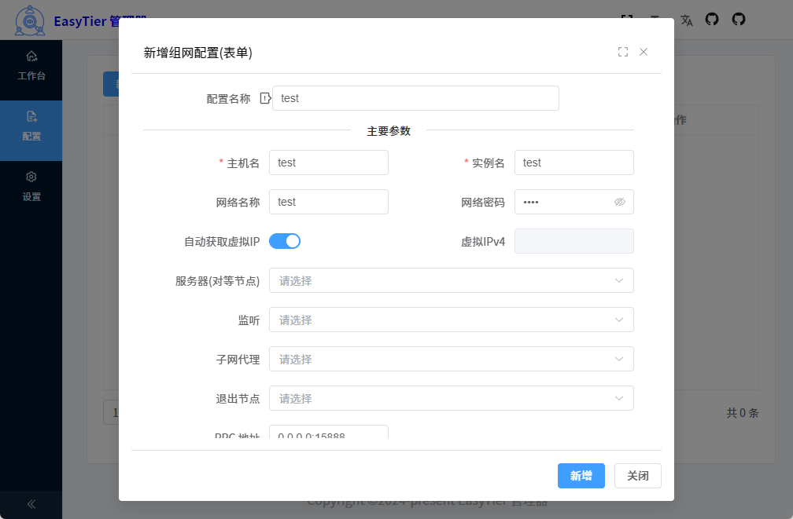

<div align="center">   <br> <br>
<h1>EasyTier 管理器 组网 内网穿透</h1>
<h3>Vue3 + Vite5 + Electron33 + Element-Plus</h3>
</div>

## 使用教程

- **1.【重要】设置页 检测内核是否存在，若不存在则下载内核，然后安装，再次检测内核是否存在**（仅首次使用需要，后续确认存在即可直接运行）


- 2.配置页新建组网配置，提供直接编辑代码的方式，和表单填写


- 3.工作台（首页）运行指定配置


- 4.[可选] 组网成功后，连接没有问题可退出管理器,核心程序会在后台运行(托盘图标右键`退出`)

- 5.[可选] 在配置页面，安装指定配置为系统服务


### 各个包说明

- `exe`：安装程序，安装后才可使用
- `zip`：免安装，解压即可使用
- `easytier-manager-win_2.0.0.exe`：64、32位 Windows 系统通用安装包
- `easytier-manager-win-x64_2.0.0.exe`：64位 Windows 系统安装包
- `easytier-manager-win-ia32_2.0.0.exe`：32位 Windows 系统安装包
- `easytier-manager-win7-x64_2.0.0.exe`: 64位 Windows 7 系统安装包
- `tar.gz` `deb` `rpm` `AppImage`：Linux系统上使用(尚未测试)

## 介绍

EasyTier 由 Rust 和 Tokio 驱动，一个简单、安全、去中心化的组网方案

EasyTier 管理器 整合Vue3 + Vite5 + Electron33 + Element-Plus， 是一个基于 `element-plus` 免费开源的组网管理器。使用了最新的
`vue3`，`vite5`，`TypeScript` 等主流技术开发。

## 特性

- **内存占用**：组网成功后，可以直接退出管理器，不会影响组网，所以不会占用内存，不会因各种问题内存泄漏
- **多配置启动**：支持多个组网配置运行、管理
- **系统服务安装**：界面化一键安装为系统服务，开机自动启动
- **可视化添加配置**：提供表单可视化添加组网配置，简单方便
- **可视化日志查看**：首页可查看当前组网配置的日志
- **一键下载安装**：一键下载安装内核，内置加速源，无需手动下载，下载完一键安装
- **最新技术栈**：使用 Electron33/Vue3/vite5 等前端前沿技术开发
- **TypeScript**: 应用程序级 JavaScript 的语言
- **国际化**：内置完善的国际化方案

## 预览





## Bug 反馈 & 建议

> 趋于稳定可能不会在开发新功能，只会修复漏洞之类的

可在 [TODO](./TODO.md) 查看是否已有记录，以免重复

[BUG 提交 | 需求建议](https://github.com/xlc520/easytier-manager/issues/new/choose)

## 前序准备

- [node](http://nodejs.org/) 和 [git](https://git-scm.com/) - 项目开发环境
- [Vite4](https://vitejs.dev/) - 熟悉 vite 特性
- [Vue3](https://v3.vuejs.org/) - 熟悉 Vue 基础语法
- [TypeScript](https://www.typescriptlang.org/) - 熟悉 `TypeScript` 基本语法
- [Es6+](http://es6.ruanyifeng.com/) - 熟悉 es6 基本语法
- [Vue-Router-Next](https://next.router.vuejs.org/) - 熟悉 vue-router 基本使用
- [Element-Plus](https://element-plus.org/) - element-plus 基本使用
- [electron](https://www.electronjs.org/zh/)

## 安装和使用

- 获取代码

```bash
git clone
```

- 安装依赖

```bash
cd

pnpm install

```

- 运行

```bash
pnpm run dev
```

- 打包

  1.编译

  ```bash
  pnpm run build:compile
  ```

  2.打包各个平台

  ```bash
  pnpm run build:win
  pnpm run build:linux
  pnpm run build:mac
  ```

## 更新日志

## 如何贡献

你可以提一个 issue 或者提交一个 Pull Request。

**Pull Request:**

1. Fork 代码
2. 创建自己的分支: `git checkout -b feat/xxxx`
3. 提交你的修改: `git commit -am 'feat(function): add xxxxx'`
4. 推送您的分支: `git push origin feat/xxxx`
5. 提交 `pull request`

## Git 贡献提交规范

- `feat` 新功能
- `fix` 修补 bug
- `docs` 文档
- `style` 格式、样式(不影响代码运行的变动)
- `refactor` 重构(即不是新增功能，也不是修改 BUG 的代码)
- `perf` 优化相关，比如提升性能、体验
- `test` 添加测试
- `build` 编译相关的修改，对项目构建或者依赖的改动
- `ci` 持续集成修改
- `chore` 构建过程或辅助工具的变动
- `revert` 回滚到上一个版本
- `workflow` 工作流改进
- `mod` 不确定分类的修改
- `wip` 开发中
- `types` 类型

## 系统支持

理论支持Windows 11 、Windows 10 、 Windows 7 、 Linux (桌面版)、MacOS(暂时无证书，无法打包测试)

## 许可证

[MIT](./LICENSE)
